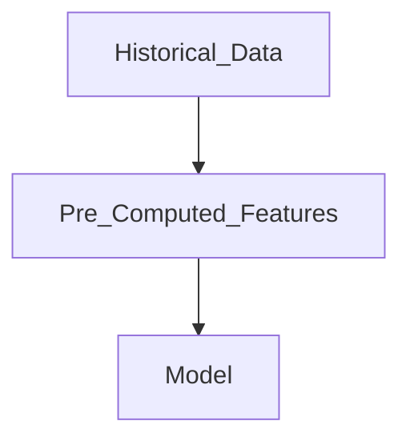
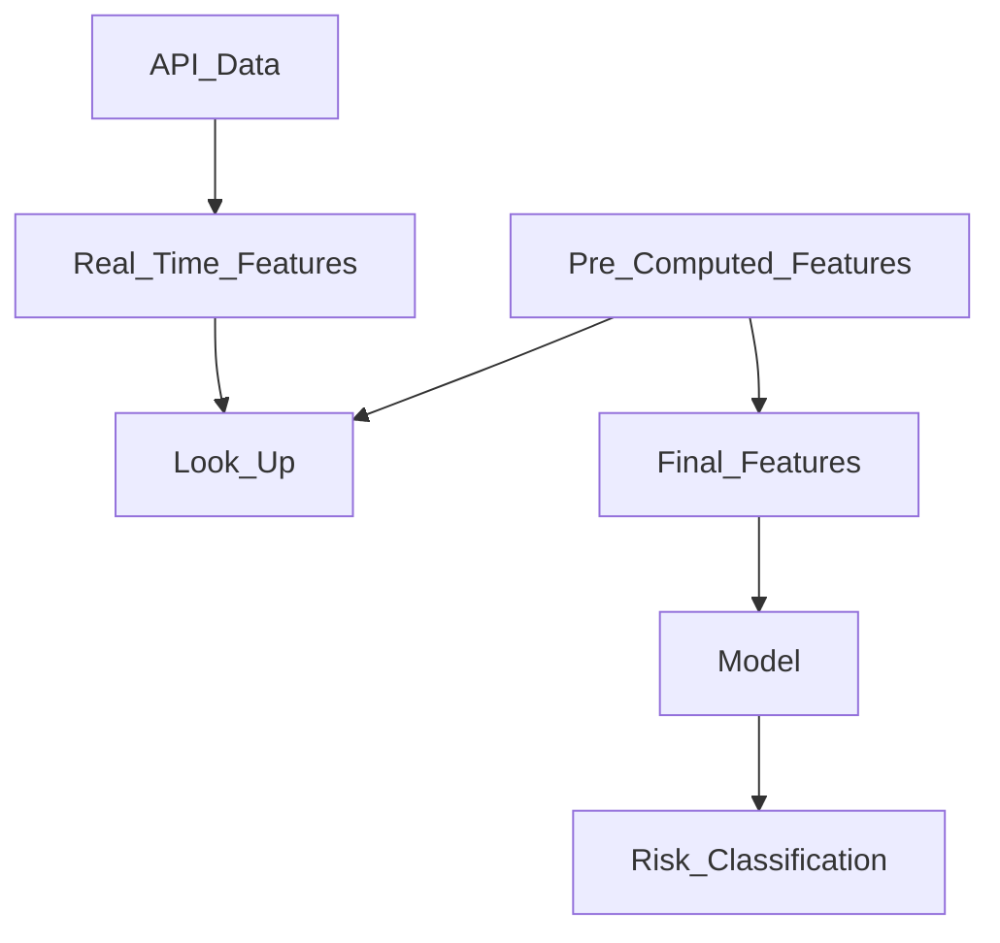
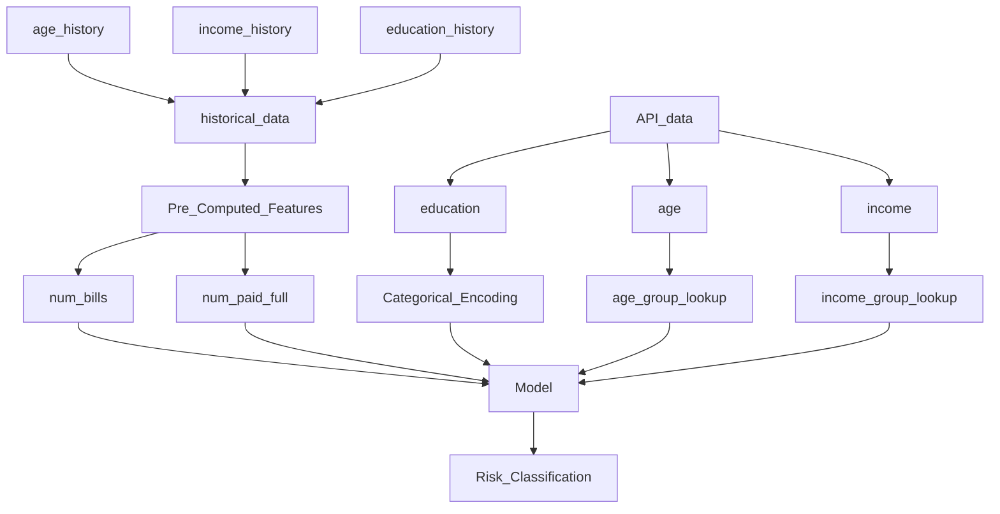

# features_demo 

This is a demo repo to illustrate how we can use the training feature pipelines in model serving code to compute features automatically without rewriting the code during model implementation. This is very basic demo and I intend to enhance it more as time permits. 

The thought here is, when we develop the model, we create feature pipelines,using a set of frameworks & standards, suhc that the computational logic can be re-used in serving code. We would need the Training and Serving environments Data to be same for this to be productive. In absence of that, we may need to create additional dataset loader framework that helps in abstracting the evnviroment nuances for the feature function logic ( more to come later on this )

## Demo1
I have a model that uses 3 features. 
  1.Customer ID
  2.Customer Age
  3.Customer Transactions Return Rate ( # of returns ) 

A basic xgboost classifier model is trained to predict probability of return for a new sale by a customer using previous customer sales & returns. 

I use a feature_mapping.json which defines the features metadata:

  1.Customer id feature is passed from the upstream invoking the model ( from api call )
  2.Customer Age is caculated using the Customer Id from a func 
  3.Customer Return Rate is calcuated using a function from transactions data and customer id
  
  feature_mapping.json tells which features are to be taken from upstream and which features needs to be computed using functions from feature pipeline code.
  
## Demo2
### Feature Engineering - Model Development Stage
Pre-Computed Features :   
Age, Income, Education, Number of bills, Number of bills paid in full

  ### Feature Engineering - Inferencing Setup
Real Time Features :   
Age, Income, Education,

  ### Detailed Data Feature Processing  
Using Age, Income & Education lookup the pre-computed features

