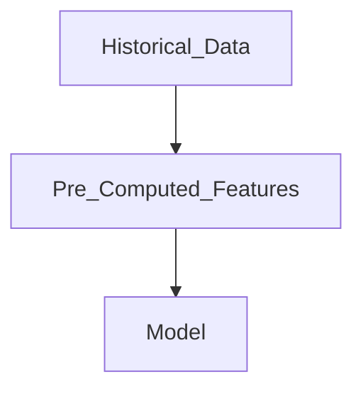
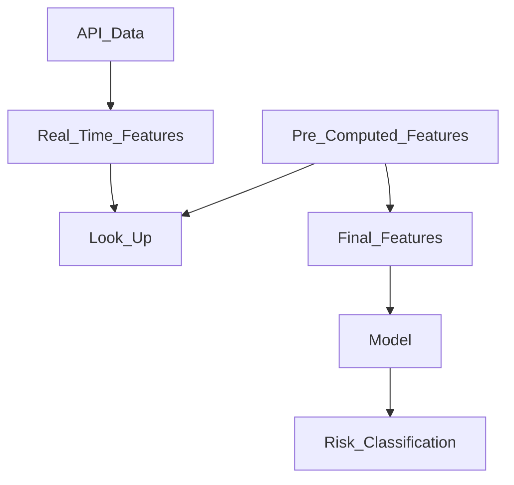
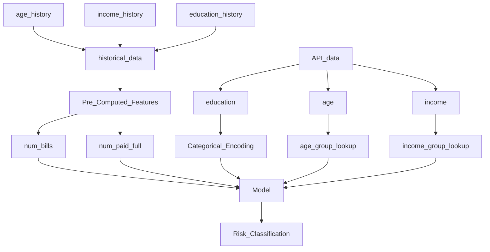

# Modular Feature Pipelines & DRML(Data Relationship Markup Language) to reduce time to productionize ML Models
### This is a concept that i'm trying to define for now. 
### Motive
#### Reduce time & effort needed to productionize ML Models. Some of long poles in productionizing a Model are:
1) Re-writing Feature Engineering pipelines in Serving lane   
2) Transitioning of Feature Engineering knowledge from Data Scientists to Software/Implementation Engineers
3) Writing Inference code for each Model Implementation

### Concept
By using combination of a framework, coding style, generic scoring inference engine(s) and a set of
tools such as Schema Registry, Data Registry, Feature Store, Model Registry, we will be able to address the
above challenges and time to deploy a model to production as below
1) Write Feature Engineering Code during Model Development in a Modular fashion thus providing 
ability to expose the Feature Computation logic to serving lanes
2) Define Data Relationship between Layers( such as API fields to Features in Inferece Pipeline ) using
metadata or DRML( Data Relationship Markup Language)
3) Apply pre-processing functions such as data validations, encoding, lookups using common functions. 
4) Abstract Training vs Serving data environment differences by exposing datasets in same way everywhere
using DataLoaders of each environment.

Below are couple of simple Demo's being experimented on above concept. 

## Demo1

I have a model that uses 3 features. 
  1.Customer ID
  2.Customer Age
  3.Customer Transactions Return Rate ( # of returns ) 

A basic xgboost classifier model is trained to predict probability of return for a new sale by a 
customer using previous customer sales & returns. 

I use a feature_mapping.json which defines the relationship of a feature across layers as metadata:

  1.Customer id feature is passed from the upstream invoking the model ( from api call )
  2.Customer Age is caculated using the Customer Id from a function 
  3.Customer Return Rate is calcuated using a function from transactions data and customer id
  
  feature_mapping.json tells which features are to be taken from upstream and which features needs to be computed using functions from feature pipeline code.
  
## Demo2

Pre-Computed Features :   
Age, Income, Education, Number of bills, Number of bills paid in full

  ### Feature Engineering - Inferencing Setup
Real Time Features :   
Age, Income, Education,

  ### Detailed Data Feature Processing  
Using Age, Income & Education lookup the pre-computed features

